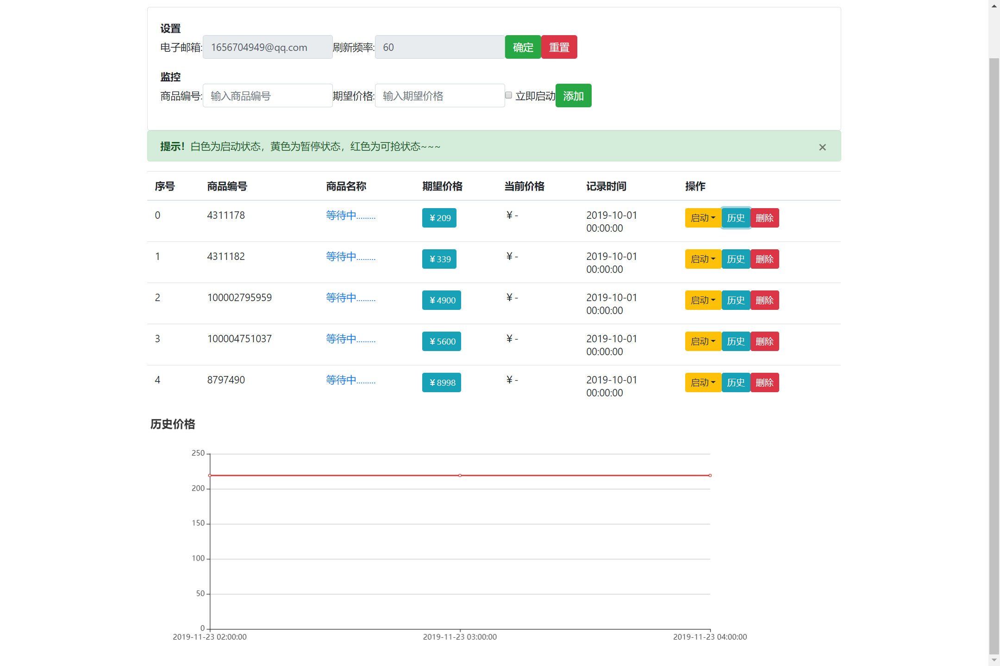

# mall-monitor
电商平台价格监控



## 技术
1. 前端：Boostrap+Jquery
2. 后端：Python+Flask
3. 爬虫：Selenium+ChromeDriver
> * https://dl.google.com/linux/direct/google-chrome-stable_current_x86_64.rpm
> * https://chromedriver.storage.googleapis.com/index.html

## 启动
```
python server.py
```

## 数据库
Goods-History:一对多

Goods:

| 属性 | 解释 | 类型 | 备注 |
| :----: | :----: | :----: | :----: |
| id | 商品编号 | String(20) | primary_key=True |
| want | 期望价格 | FLOAT | nullable=False |
| status | 运行状态 | BOOLEAN | nullable=False |

History:

| 属性 | 解释 | 类型 | 备注 |
| :----: | :----: | :----: | :----: |
| date | 历史日期 | Integer | primary_key=True |
| price | 历史价格 | FLOAT | nullable=False |
| gid | 商品编号 | String(20) | primary_key=True, ForeignKey |

## 邮箱
修改`config.cfg`的参数，可以上网搜索怎么申请qq邮箱smtp密码~
```
[mail]
host     = smtp.qq.com
port     = 25
user     = 1656704949@qq.com
pass     = xxxxxxxxxxxxxxxx
sender   = 1656704949@qq.com
```